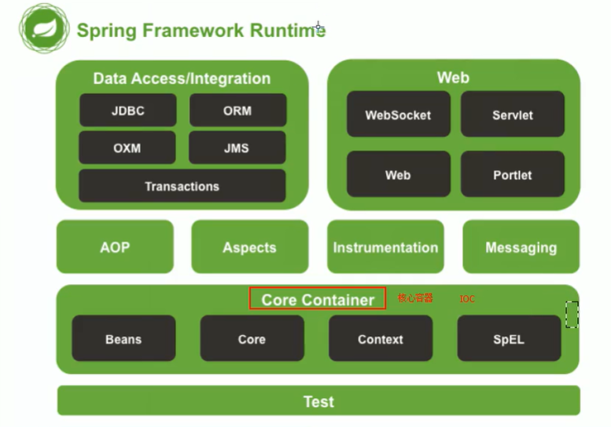

## spring Framework 总览




## IOC重新认识

- POJO 贫血模式

- java beans 自省

- 

- 沙雕面试题- 什么是IoC ？

  - 答：简单地说，IoC 是反转控制，类似于好莱坞原则，主要有依赖查找
    和依赖注入实现。javabean是一种IoC实现，通过构造器注入,setter注入。消息推送也是一种IoC

- 996 面试题- 依赖查找和依赖注入的区别？

  - 答：依赖查找是主动或手动的依赖查找方式，通常需要依赖容器或标准API
    实现。而依赖注入则是手动或自动依赖绑定的方式，无需依赖特定的容器和
    API。

- 劝退面试题- **Spring 作为IoC 容器有什么优势？**

  - 答：
    典型的IoC 管理，依赖查找和依赖注入
    AOP 抽象
    事务抽象。
    事件机制。event listener
    SPI 扩展。
    强大的第三方整合。jdbc
    易测试性。
    更好的面向对象。设计模式用得非常好。

  ## Spring Ioc 容器概述

- spring 组装一个java bean
    - ```
      // 初始化spring容器
      BeanFactory beanFactory = new ClassPathXmlApplicationContext("classpath:/META-INF/dependency-lookup-context.xml");
      // 配置javabean
      <bean id="user" class="org.geekbang.thinking.in.spring.ioc.overview.domain.User">
        <property name="id" value="1"/>
      </bean>
      ```

    >  // 配置完之后这个类被spring **组装**了
    
- 给一个类加注解的时候，可以参考component注解上面的注解

-  ObjectFactory 通常是针对单类 Bean 做延迟获取的，BeanFactory 则是全局 Bean 管理的容器。

- 要**区别依赖注入和依赖查找**的概念，首先要明确这2个概念的相关角色，当只有2个角色时，A为依赖其他角色的角色，B为依赖角色，那么A依赖B时，只能让A去查找B，需要在A内部显式的声明出依赖查找的过程，这也就是我举的例子里的listableBeanFactory.getBeansOfType，而当有了可以注入角色C时，则变成了A依赖B需要通过C来注入，xml的bean配置其实是告诉C注入，而不需要在A内部显式的声明出依赖查找的过程，而C去找依赖时，也是需要去查找的，但是不能认为A的查找（是为了自己用）和C的查找（是为了他人用）是一致的。<bean id="userRepository" class="ioc.overview.repository.UserRepository"
      autowire="byType">这个autowire就是A角色（UserRepository）告诉C角色（Spring容器）靠type依赖了B角色（User、BeanFactory等）

- 依赖的来源:

    - 总结spring依赖来源的三个方向
        1. 自定义Bean(自己用xml配置或注解配置的bean)
        2. 内部容器依赖的Bean(非自己定义的Bean,spring容器初始化的Bean)，比如Environment对象
        3.  内部容器所构建的依赖(非Bean,不可通过获取依赖查找Bean的方法来获取(getBean(XXX)))，比如BeanFactory
    - 1.内建依赖指的是DefaultListableBeanFactory属性resolvableDependencies这个map里面保存的bean，自定义bean指的是通过DefaultSingletonBeanRegistry#registerSingleton手动注册的bean。它们都在BeanFactory里面；
        2.依赖注入的时候比如@AutoWired(AutowiredAnnotationBeanPostProcessor处理)会调用DefaultListableBeanFactory#resolveDependency方法去resolvableDependencies里面找，而依赖查找BeanFactory.getBean(xxx)是不会去resolvableDependencies这个map里面找的。

- BeanFactory 和ApplicationContext 谁才是Spring IoC 容器？

    - In short, the `BeanFactory` provides the configuration framework and basic functionality, and the `ApplicationContext` adds more enterprise-specific functionality. The `ApplicationContext` is a complete superset of the `BeanFactory` and is used exclusively in this chapter in descriptions of Spring’s IoC container. For more information on using the `BeanFactory` instead of the `ApplicationContext`
    - BeanFactory和ApplicationContext有何区别？
        ● ApplicationContext是BeanFactory的子接口
        ● BeanFactory是一个底层的IOC容器，提供了IOC容器的基本实现，而ApplicationContext则是BeanFactory的超集提供了丰富的企业级特性。
        ● ApplicationContext是委托DefaultListableBeanFactory来实现Bean的依赖查找和依赖注入。

- ApplicationContext除了IoC容器角色，还提供哪些特性？

    - BeanFactory 是 Bean 容器，它不提供企业特性，比如 AOP、事务以及 事件等，这些都被 ApplicationContext 支持。

- 沙雕面试题- 什么是Spring IoC 容器？

    -  答：Spring Framework implementation of the Inversion of
        Control (IoC) principle. IoC is also known as dependency
        injection (DI). It is a process whereby objects define their
        dependencies (that is, the other objects they work with) only
        through constructor arguments, arguments to a factory
        method, or properties that are set on the object instance after it
        is constructed or returned from a factory method. The container
        then injects those dependencies when it creates the bean.

- 996 面试题- BeanFactory 与FactoryBean？

    - 答：
        BeanFactory 是IoC 底层容器
        FactoryBean 是创建Bean 的一种方式，帮助实现复杂的初始化逻辑

- 劝退面试题- Spring IoC 容器启动时做了哪些准备？

    - 答：IoC 配置元信息读取和解析、IoC 容器生命周期、Spring 事件发布、国
        际化等，更多答案将在后续专题章节逐一讨论


## Spring Bean基础

- 这三个实现当时有什么区别呢，或者是实际应用中该如何选择

  作者回复: 没有本质的区别，主要是场景选择，如果偏好接口的方式，那么使用，InitlaizatingBean 来实现。如果偏好注解的方式，那么 @PostConstruct 则是一种通用的选择，包括 Java EE 容器也会初始化。如果你想解耦的话，那么使用 XML 配置 init-method 或者 @Bean#initMethod(） 的方式也好。

- 沙雕面试题- 如何注册一个Spring Bean？

  - 答：通过BeanDefinition 和外部单体对象来注册

- 996 面试题- 什么是Spring BeanDefinition？

  - 答：回顾“定义Spring Bean” 和“BeanDefinition 元信息”

- 劝退面试题- Spring 容器是怎样管理注册Bean

  - 答：答案将在后续专题章节详细讨论，如：IoC 配置元信息读取和解析、依赖
    查找和注入以及Bean 生命周期等。

## 第五章：Spring IoC依赖查找（Dependency Lookup） (9讲)

- 